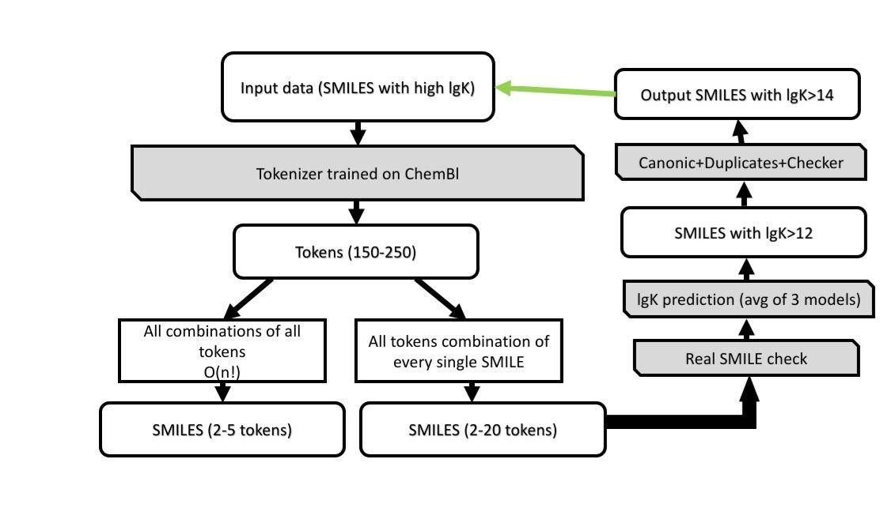
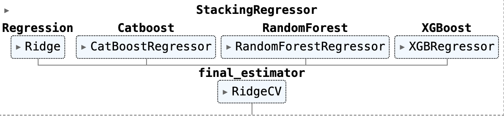
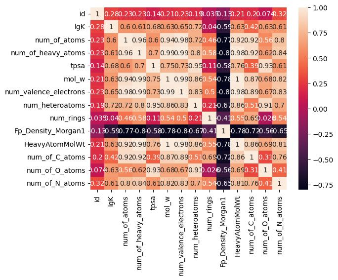

# Radiopharmaceutical Chelator Design — SMILES Generator

**Short description**
A completed proof-of-concept pipeline that generates 100 candidate chelator SMILES optimized for predicted radionuclide binding (lgK) while satisfying chemical and drug-like constraints. Pipeline includes token-based SMILES generation, stacking regression models, RDKit validation, and diversity filtering.

---

## Background (project purpose)


Radiopharmaceuticals are drugs that deliver radionuclides to tumors for diagnosis and therapy. Each radiopharmaceutical typically consists of three modules:

* a biological vector (for targeting)
* a radionuclide (the therapy/diagnostic agent)
* a chelator (which binds the radionuclide and links it to the vector)

This project focused on discovering small-molecule chelators that tightly bind medical radionuclides. Rather than running exhaustive wet-lab chemistry, we used in-silico screening to suggest promising candidates faster.

---

## What was done

* Tokenizer trained on ChEMBL SMILES and used to break input molecules into tokens (typical token length 150–250 tokens).
* Exhaustive and targeted combinatorial generation of SMILES token sequences (short enumerations from 2–20 tokens, and short combinations 2–5 tokens across token pool) to propose novel molecules.
* Chemical validity checks using RDKit (SMILES parsing, sanitization, canonicalization).
* A stacking regression model trained to predict lgK (binding efficiency) from molecular descriptors and learned embeddings.

  * **Base models**: Ridge, CatBoostRegressor, RandomForestRegressor, XGBRegressor.
  * **Final estimator**: RidgeCV (stacking meta-model).
* Ensemble prediction (average of 3 independently trained models) used to rank generated molecules.
* Post-processing pipeline that applied all project constraints and filters, removed duplicates and molecules present in the training set, and produced the final set of 100 recommendations.
* Exploratory data analysis (EDA) was performed; a correlation matrix and descriptor-target correlation subplots were produced.

---

## Task specification

**Objective:** generate a set of 100 novel molecules (SMILES) that maximize predicted binding affinity (lgK) under the constraints below.

**Constraints enforced on generated molecules:**

* Elements allowed: C, H, O, N, P, S only.
* Each molecule must contain at least 3 different elements from the list above.
* Total number of heteroatoms (O, N, P, S) per molecule ≤ 12.
* Molecules must NOT be present in the training set (novelty enforced by canonical SMILES matching).
* Molecular weight ≤ 500 Da.
* Synthetic accessibility (SAScore) < 5 (computed per the referenced RDKit-based SAScore implementation).
* Average pairwise similarity across the final set (Tanimoto on Morgan fingerprints with default parameters) < 0.5.

**Metric:** average predicted lgK of the returned 100-molecule selection.

---

## Data

* **Input:** training set of molecules as SMILES with experimentally measured lgK values (used to train predictive models).
* **Derived data:** RDKit descriptors (physicochemical features), Morgan fingerprints, and tokenized SMILES.

---

## Model & architecture

Below are the visual diagrams from the `Images/` directory:

### Full Pipeline



### Stacking Regression Model



## Model & architecture

The predictive model used a stacking regressor to improve robustness and capture heterogeneous signal across descriptor types.

**Stacking architecture (implemented):**

* Base learners: `Ridge`, `CatBoostRegressor`, `RandomForestRegressor`, `XGBRegressor`.
* Meta (final) learner: `RidgeCV` trained on out-of-fold predictions from the base learners.

This architecture was trained with cross-validation; we trained three independent stacking pipelines and averaged their predictions for final ranking to reduce variance.

---

## EDA (what we inspected)

* Distribution of lgK in the training set and target distribution for generated molecules.
* Descriptor distributions (LogP, MW, H-bond donors/acceptors, topological polar surface area, etc.).
* Pearson correlation matrix across descriptors and lgK. The correlation analysis is included shows that while no single descriptor fully determines lgK, some descriptors (e.g., lipophilicity-related features) show moderate correlation with binding efficiency. This motivated including both learned token-based features and classical descriptors in the model.


---

## Filtering & post-processing steps (implemented)

1. Parse and sanitize generated SMILES with RDKit; drop invalid molecules.
2. Compute molecular properties (MW, element composition, heteroatom count) and discard molecules violating constraints.
3. Compute SAScore and drop molecules with SAScore ≥ 5.
4. Remove molecules that are present in the training set (by canonical SMILES match).
5. Remove duplicates and canonicalize SMILES.
6. Enforce diversity: compute pairwise Tanimoto similarities on Morgan fingerprints and greedily select molecules until reaching 100 with average pairwise similarity < 0.5.
7. Output final list of 100 SMILES with predicted lgK and all calculated properties in `results/final_100.csv`.

---

## ---

## Project tree (actual)

Below is the exact project structure and key files present in this repository. Images from `Images/` are referenced in the README and included in the repo.

```
All combinations of all tokens/
  Generation.ipynb
  gens_evaluate.ipynb
  new_model (1).ipynb
  str.ipynb

Baseline/
  base_tune.ipynb
  baseline_tune.ipynb

Checker/
  checker_submit
  zink_big_len.ipynb

Datasets/
  250k_rndm_zinc_drugs_clean_3.csv
  SPE_ChEMBL.txt
  shard_00.smi
  zink_smiles.csv

EDA/
  corr_cov.ipynb

Generated molecules/
  Copy of 1.csv
  Copy of 2.csv
  Copy of 3.csv
  Copy of 4.csv

Images/
  Annotation.png
  Pipeline.jpg
  Correlation/  (correlation plots folder)
  StackingRegressionModel.png

LogP prediction/
  logp_predictionipynb.ipynb
  main_edited.ipynb
  main.ipynb

Models/
  cb.joblib
  lr.joblib
  rf.joblib
  lstm-nto.ipynb
  stacking_regressor.ipynb
  Submit_creation.ipynb

Submits/
  Copy of 3k_permutation_valid.csv
  Copy of check_tune_base_valid.xls
  Copy of gen_third_submit.csv
  Copy of gen_top_valid_first.csv
  Copy of hope_base.csv
  Copy of hope1.csv
  Copy of lstm_gen.csv
  Copy of submit_10.csv
  Copy of submit_11.csv
  Copy of submit_12.csv
  Copy of submit_13.csv
  Copy of submit_14.csv
  Copy of submit_100.csv
  Copy of submit_200.csv
  final.csv

Other files in repo root:
  Information on the binding of a medical radionuclide by various molecules.csv
  LICENSE (MIT)
  README.md
```

### Notes on folders

* `All combinations of all tokens/` — notebooks for token-based generation and evaluation.
* `Baseline/` — baseline modeling notebooks used for initial experiments.
* `Checker/` and `For Checker/` — validation and submission-related files used for checker-stage evaluation.
* `Datasets/` — original datasets and ChEMBL/ZINC text files used to build tokenizer and training data.
* `Generated molecules/` — exploratory generated molecule CSVs (intermediate outputs).
* `Images/` — visual assets used in README (Pipeline, Stacking model, Correlation). The README references `Images/Pipeline.jpg`, `Images/StackingRegressionModel.png`, and the correlation plots folder.

---

## Results & notes

* The pipeline returned 100 chemically valid and diverse SMILES candidates that satisfy the stated constraints. The output CSV contains predicted lgK scores (average of three stacking pipelines) and computed descriptors used for selection.
* All filtering constraints were applied programmatically; a short validation notebook demonstrates constraint-checking for every selected molecule.

---

## License

MIT
